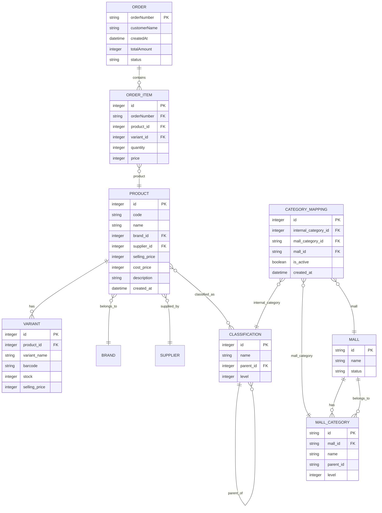

# Information Architecture & Data Model — react-oms-wireframe

작성일: 2025-09-14

이 문서는 현재 리포지터리의 주요 데이터 모델, 엔티티 스키마, 페이지별 정보구조(Internal IA), 컴포넌트 매핑, 그리고 제안된 API 엔드포인트 및 마이그레이션 고려사항을 정리합니다. 배포/개발/백엔드 연동 시 참고하세요.

---

## 1) 요약
- 주요 도메인 엔티티: Product, Variant, Order, Classification, CategoryMapping, Mall, Brand, Supplier
- 문서의 목적: 프론트엔드 상태와 향후 백엔드 연동을 위한 최소 스키마, ER(개체-관계) 다이어그램, 각 페이지의 데이터 요구사항 및 CRUD 플로우를 명시.

---

## 2) ER 다이어그램 (Mermaid)
아래 mermaid 다이어그램은 주요 엔티티와 관계를 보여줍니다. (README나 문서에서 시각적으로 렌더링 가능)



> 개발 참고: Mermaid를 지원하는 마크다운 뷰어나 Confluence에 붙이면 ER 다이어그램이 시각화됩니다.

---

## Mermaid 렌더 (브라우저에서 즉시 보기)

아래 HTML 스니펫은 브라우저에서 Markdown 파일을 열거나, HTML로 렌더링 가능한 뷰어에서 그대로 붙여넣으면 Mermaid 스크립트를 통해 다이어그램을 즉시 렌더합니다.

주의: GitHub의 기본 마크다운 뷰어나 보안 정책이 엄격한 환경에서는 인라인 스크립트가 차단되어 렌더되지 않을 수 있습니다. 그럴 경우 `mermaid.live` 또는 로컬 마크다운 프리뷰(예: VS Code의 Markdown Preview) 사용을 권장합니다.

<!-- Mermaid HTML 렌더 블록 (브라우저/지원 뷰어에서 동작) -->
<div class="mermaid">
erDiagram
  PRODUCT ||--o{ VARIANT : has
  PRODUCT }o--|| BRAND : belongs_to
  PRODUCT }o--|| SUPPLIER : supplied_by
  PRODUCT }o--o{ CLASSIFICATION : classified_as
  CLASSIFICATION ||--o{ CLASSIFICATION : parent_of
  MALL ||--o{ MALL_CATEGORY : has
  MALL_CATEGORY }o--|| MALL : belongs_to
  CATEGORY_MAPPING }o--|| CLASSIFICATION : internal_category
  CATEGORY_MAPPING }o--|| MALL_CATEGORY : mall_category
  CATEGORY_MAPPING }o--|| MALL : mall
  ORDER ||--o{ ORDER_ITEM : contains
  ORDER_ITEM }o--|| PRODUCT : product

  PRODUCT {
    integer id PK
    string code
    string name
    integer brand_id FK
    integer supplier_id FK
    integer selling_price
    integer cost_price
    string description
    datetime created_at
  }
  VARIANT {
    integer id PK
    integer product_id FK
    string variant_name
    string barcode
    integer stock
    integer selling_price
  }
  CLASSIFICATION {
    integer id PK
    string name
    integer parent_id FK
    integer level
  }
  MALL {
    string id PK
    string name
    string status
  }
  MALL_CATEGORY {
    string id PK
    string mall_id FK
    string name
    string parent_id
    integer level
  }
  CATEGORY_MAPPING {
    integer id PK
    integer internal_category_id FK
    string mall_category_id FK
    string mall_id FK
    boolean is_active
    datetime created_at
  }
  ORDER {
    string orderNumber PK
    string customerName
    datetime createdAt
    integer totalAmount
    string status
  }
  ORDER_ITEM {
    integer id PK
    string orderNumber FK
    integer product_id FK
    integer variant_id FK
    integer quantity
    integer price
  }
</div>

<!-- Mermaid CDN 및 초기화: 뷰어가 인라인 스크립트를 허용할 때 동작합니다. -->
<script src="https://cdn.jsdelivr.net/npm/mermaid@10/dist/mermaid.min.js"></script>
<script>if(window.mermaid){mermaid.initialize({startOnLoad:true, securityLevel:'loose'});}</script>

---

## 내보낸 ER 다이어그램 (SVG)

아래 이미지는 repo에서 생성한 정적 ER 다이어그램입니다. 이미지 파일은 `docs/diagrams/er_diagram.svg`에 저장되어 있습니다. Git 호스팅 환경에서 바로 보이므로 mermaid 스크립트를 허용하지 않는 뷰어에서도 다이어그램 확인이 가능합니다.




## 3) JSON Schema (주요 엔티티)
아래는 프론트엔드가 기대하는 최소 속성으로 작성한 JSON 스키마 예시입니다.

### 3.1 Product
```json
{
  "$schema": "http://json-schema.org/draft-07/schema#",
  "title": "Product",
  "type": "object",
  "required": ["id", "code", "name", "selling_price"],
  "properties": {
    "id": { "type": "integer" },
    "code": { "type": "string" },
    "name": { "type": "string" },
    "brand": { "type": "string" },
    "supplier_id": { "type": "integer" },
    "selling_price": { "type": "integer" },
    "cost_price": { "type": "integer" },
    "description": { "type": "string" },
    "created_at": { "type": "string", "format": "date-time" },
    "variants": {
      "type": "array",
      "items": {
        "type": "object",
        "required": ["id", "variant_name"],
        "properties": {
          "id": { "type": "integer" },
          "variant_name": { "type": "string" },
          "stock": { "type": "integer" },
          "selling_price": { "type": "integer" }
        }
      }
    }
  }
}
```

### 3.2 Classification
```json
{
  "$schema": "http://json-schema.org/draft-07/schema#",
  "title": "Classification",
  "type": "object",
  "required": ["id", "name", "level"],
  "properties": {
    "id": { "type": "integer" },
    "name": { "type": "string" },
    "parentId": { "type": ["integer", "null"] },
    "level": { "type": "integer" }
  }
}
```

### 3.3 CategoryMapping
```json
{
  "$schema": "http://json-schema.org/draft-07/schema#",
  "title": "CategoryMapping",
  "type": "object",
  "required": ["id", "internalCategoryId", "mallCategoryId", "mallId"],
  "properties": {
    "id": { "type": "integer" },
    "internalCategoryId": { "type": "integer" },
    "mallCategoryId": { "type": "string" },
    "mallId": { "type": "string" },
    "isActive": { "type": "boolean" },
    "createdAt": { "type": "string", "format": "date-time" }
  }
}
```

---

## 4) 페이지별 IA (정보 구조) 및 데이터 플로우
아래는 각 페이지가 필요로 하는 데이터, 주요 컴포넌트, 입력/출력, 사용자 시나리오를 정리합니다.

### 4.1 Products List
- 데이터 소스: `mockProducts` (향후 API: `GET /api/products?filters...`)
- 입력(필터): 검색어, 분류(id or classification name), 브랜드, 상태, 정렬, 페이지번호
- 출력: 제품 리스트(페이징), 각 제품의 요약(가격, 재고, 분류, 브랜드)
- 컴포넌트: `HierarchicalSelect`(분류), `TableExportButton`, pagination, product rows
- 액션: 상세보기, 일괄 액션(엑셀/활성화/비활성화/삭제)

### 4.2 Product Detail
- 데이터 소스: 제품 단건 조회(현재 mock), API: `GET /api/products/:id`
- 출력: 제품 상세(이미지, 옵션, 가격, 재고, 설명)
- 액션: 설명 편집(모달), 설정(모달)

### 4.3 Product Classifications
- 데이터 소스: `localStorage` 또는 API `GET /api/classifications`
- 주요 컴포넌트: 트리 렌더러, 편집/추가/삭제 모달, `AnimatedCollapse`
- CRUD 액션: 생성(루트/자식), 편집, 삭제(삭제 전 미리보기), 저장(localStorage 또는 `POST/PUT /api/classifications`)

### 4.4 Category Mapping
- 데이터 소스: 내부 카테고리, 쇼핑몰 카테고리(쇼핑몰 선택 시), 현재 매핑 목록
- 입력: 쇼핑몰 선택, 내부 카테고리 선택, 쇼핑몰 카테고리 선택
- 출력: 매핑 테이블(경로 표기), 통계, 엑스포트
- 액션: 매핑 생성(`POST /api/mappings`), 삭제(`DELETE /api/mappings/:id`), 활성/비활성 토글(`PATCH /api/mappings/:id`)

### 4.5 Orders
- 데이터 소스: `mockOrders`(향후 `GET /api/orders`)
- 필터/정렬 적용 후 CSV 내보내기
- 컴포넌트: `OrderTable`, `OrderFilters`, `Pagination`

---

## 5) 제안된 REST API 엔드포인트 (추가/마이그레이션 시 참고)
- Products
  - `GET /api/products` (필터/페이지네이션/정렬)
  - `GET /api/products/:id`
  - `POST /api/products`
  - `PUT /api/products/:id`
  - `DELETE /api/products/:id`
- Classifications
  - `GET /api/classifications` (트리 포함)
  - `POST /api/classifications` (새 분류 생성)
  - `PUT /api/classifications/:id` (편집)
  - `DELETE /api/classifications/:id` (하위 포함 삭제—서버에서 트랜잭션 처리 권장)
- Category Mappings
  - `GET /api/mappings?mallId=...`
  - `POST /api/mappings` (body: internalCategoryId, mallCategoryId, mallId)
  - `PATCH /api/mappings/:id` (isActive 변경)
  - `DELETE /api/mappings/:id`
- Orders
  - `GET /api/orders`
  - `GET /api/orders/:id`
  - `POST /api/orders` (수집/수동 생성)

---

## 6) 마이그레이션/운영 고려사항
- 분류 삭제 시 하위 노드를 함께 제거하는 로직은 서버 트랜잭션으로 처리되어야 하며, 삭제 전 미리보기(프론트)와 서버 검증을 병행할 것.
- 매핑 데이터는 대용량(수천~만건)으로 커질 수 있으니 페이징, 인덱싱(내부카테고리, 쇼핑몰ID) 및 배치 업로드 API를 준비할 것.
- `HierarchicalSelect`의 포탈/컬럼 렌더 방식은 서버에서 반환하는 카테고리 트리 깊이와 폭에 따라 클라이언트 성능에 영향 가능 — 서버에서 필요한 깊이만 반환하는 옵션 제공 권장.

---

## 7) 파일 및 코드 참조
- `src/pages/settings/ProductClassificationsPage.tsx`
- `src/components/common/HierarchicalSelect.tsx`
- `src/pages/malls/CategoryMappingPage.tsx`
- `src/pages/products/ProductsListPage.tsx`

---

작성자: 자동 생성된 IA 문서. 추가 필드/스키마가 필요하면 알려주세요.
