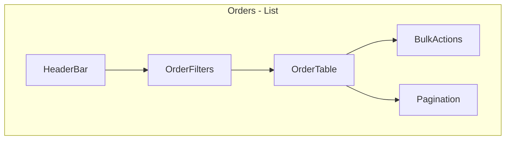
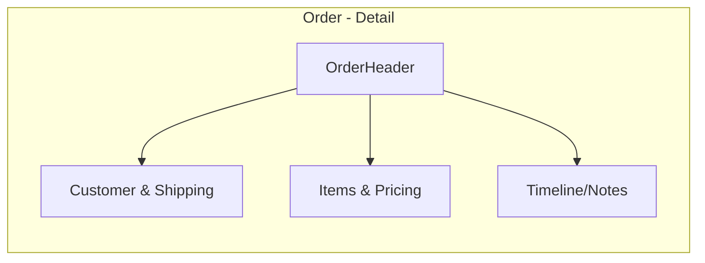
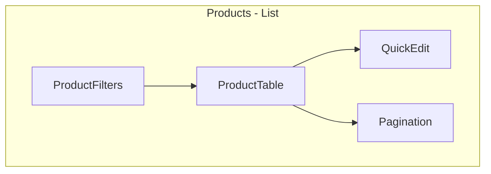
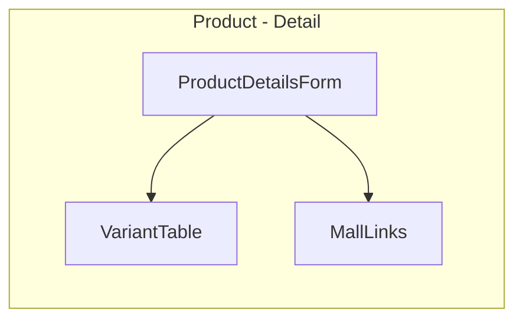
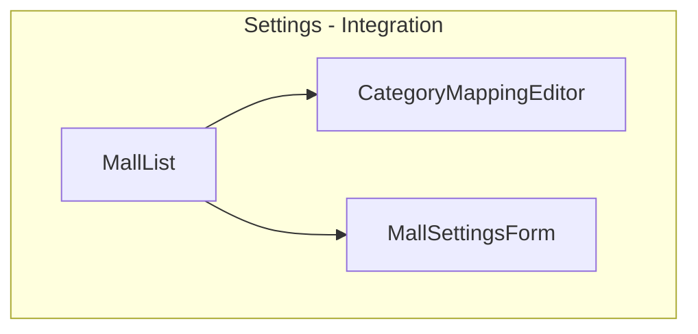
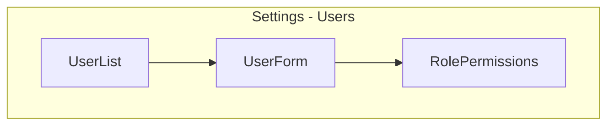

# FDD: Feature-Driven Development 문서

## 1. 개요
- **프로젝트명**: React OMS Wireframe
- **목표**: React + TypeScript 기반의 객체지향 Order Management System(주문관리시스템) 와이어프레임을 제공한다. 확장성 있는 모델과 재사용 가능한 컴포넌트를 통해 주문, 상품, 쇼핑몰 연동, 재고 관리 등 핵심 OMS 기능을 시연한다.
- **대상 사용자**: 물류/상품/CS 담당자, 쇼핑몰 통합 운영자

## 2. 핵심 가치 제안
- 빠른 주문 조회 및 상태 변경
- 일관된 상품/재고 관리 인터페이스
- 외부 쇼핑몰(마켓) 연동을 위한 매핑 및 설정
- 확장 가능한 객체지향 모델과 타입 안전성

## 3. 주요 기능(Feature List)

### 3.1 주문 관리
- 설명: 주문 목록 조회, 검색, 필터, 상태 변경
- 핵심 화면: `src/pages/orders/*`, `src/components/orders/*`
- 수용 기준:
  - 주문 목록에서 주문을 조회할 수 있다.
  - 주문 상태를 변경(update)하면 UI에서 반영된다.
  - 주문 검색(주문번호/고객명) 결과를 필터링한다.

### 3.2 상품 관리
- 설명: 상품 목록, 상세, 재고 및 변형 관리
- 핵심 화면: `src/pages/products/*`, `src/components/products/*`
- 수용 기준:
  - 상품 목록을 페이징하여 노출한다.
  - 상품 상세에서 재고와 가격 정보를 확인·편집할 수 있다.

### 3.3 쇼핑몰 연동 설정
- 설명: Mall 연결 정보, 카테고리 매핑, 통합 설정
- 핵심 화면: `pages/settings/integration.tsx`, `src/components/integrations/*`
- 수용 기준:
  - 쇼핑몰 연결 상태를 토글할 수 있다.
  - 카테고리 매핑 목록을 생성/수정/삭제할 수 있다.

### 3.4 사용자 및 권한 관리
- 설명: 사용자 계정, 역할 기반 접근 제어
- 핵심 화면: `src/pages/settings/users/*`
- 수용 기준:
  - 사용자를 추가/수정/삭제할 수 있다.
  - 역할에 따라 특정 UI/액션을 숨김/허용한다.

## 4. 페이지별 상세 설계

아래 섹션은 각 주요 페이지의 목적, 주요 컴포넌트, 데이터 요구사항, 수용 기준, 그리고 기본 사용자 플로우를 설명합니다.

### `/orders` - 주문 목록 페이지
- 목적: 모든 주문을 조회하고 검색/필터/일괄 작업(상태 변경, 출력 등)을 수행한다.
- 주요 컴포넌트:
  - `OrderTable` (목록, 페이징, 정렬)
  - `OrderFilters` (상태, 날짜, 키워드)
  - `BulkActions` (선택 주문에 대한 일괄 상태 변경)
- 데이터 요구사항:
  - 주문 리스트 (id, orderNumber, customerName, status, totalAmount, createdAt)
  - 페이징/필터 파라미터
- 수용 기준:
  - 기본 페이지 로드 시 20건의 주문이 표시된다.
  - 주문 번호/고객명으로 검색이 작동한다.
  - 체크박스 선택 후 일괄 상태 변경이 가능하다.
- 사용자 플로우 예시:
  1. 운영자는 기간 필터를 설정한다.
  2. 결과에서 특정 주문을 선택한다.
  3. '배송 처리' 상태로 일괄 변경을 실행한다.

### `/orders/:id` - 주문 상세 페이지
- 목적: 주문의 상세 정보(고객, 배송, 결제, 주문 항목)를 확인하고 개별 조치를 수행한다.
- 주요 컴포넌트:
  - `OrderHeader` (주문번호, 상태 토글)
  - `OrderItemsList` (상품별 수량/옵션)
  - `CustomerCard` (고객 연락처)
  - `ShippingCard` (배송지, 배송사, 운송장 입력)
- 데이터 요구사항:
  - 주문 상세 (items: OrderItem[], customer, shipping, payment, logs)
- 수용 기준:
  - 주문의 상태를 변경하면 변경 이력이 생성된다.
  - 운송장 번호를 입력하면 화면에 저장된다.
- 사용자 플로우 예시:
  1. CS 담당자가 주문 상세를 열어 고객 연락처를 확인한다.
  2. 배송사와 운송장 번호를 입력하고 상태를 '배송중'으로 변경한다.

### `/products` - 상품 목록 페이지
- 목적: 상품을 검색, 필터링, 페이징하여 관리한다.
- 주요 컴포넌트:
  - `ProductList` (썸네일, 코드, 이름, 가격, 재고)
  - `ProductFilters` (카테고리, 브랜드, 상태)
  - `ProductQuickEdit` (인라인 재고/가격 수정)
- 데이터 요구사항:
  - 상품 요약 리스트 (id, code, name, price, stock, active)
- 수용 기준:
  - 카테고리 필터로 상품 목록이 필터링된다.
  - 인라인 편집으로 재고 수량을 즉시 수정 가능하다.
- 사용자 플로우 예시:
  1. 재고 담당자는 '재고 부족' 필터를 적용한다.
  2. 목록에서 특정 상품의 재고를 인라인으로 수정한다.

### `/products/:id` - 상품 상세 페이지
- 목적: 상품의 상세 정보를 보고 편집(가격, 재고, 옵션, 설명)을 수행한다.
- 주요 컴포넌트:
  - `ProductDetailsForm` (기본 정보, 설명, 가격)
  - `VariantTable` (옵션 및 재고)
  - `MallLinks` (연동된 쇼핑몰 게시 상태)
- 데이터 요구사항:
  - 상품 전체 정보 (variants, categories, images, mallMappings)
- 수용 기준:
  - 상품 저장 시 변경내역과 타임스탬프가 기록된다.
  - 옵션(variant) 추가/수정/삭제가 가능하다.
- 사용자 플로우 예시:
  1. 상품 담당자가 가격을 변경하고 저장한다.
  2. 변경 내역이 기록되고 목록에 반영된다.

### `/settings/integration` - 쇼핑몰 연동 설정
- 목적: 외부 쇼핑몰 연결 설정과 카테고리 매핑을 관리한다.
- 주요 컴포넌트:
  - `MallList` (등록된 쇼핑몰 목록 및 연결 상태)
  - `CategoryMappingEditor` (내부↔외부 카테고리 매핑)
  - `MallSettingsForm` (API 키/시크릿 입력)
- 데이터 요구사항:
  - 쇼핑몰 목록, 매핑 테이블, 연결 설정
- 수용 기준:
  - 쇼핑몰 연결 상태를 토글하면 연결 테스트가 실행된다.
  - 카테고리 매핑은 저장 후 즉시 적용(매핑 데이터는 별도 서비스에서 참조)
- 사용자 플로우 예시:
  1. 통합 관리자가 신규 쇼핑몰을 추가하고 API 키를 입력한다.
  2. 연결 테스트가 성공하면 쇼핑몰 상태가 '연결됨'으로 표시된다.

### `/settings/users` - 사용자 관리
- 목적: 사용자 계정, 역할 및 접근 권한을 관리한다.
- 주요 컴포넌트:
  - `UserList` (계정 목록)
  - `UserForm` (생성/수정 폼)
  - `RolePermissions` (역할별 권한 체크리스트)
- 데이터 요구사항:
  - 사용자 목록, 역할 정의, 권한 매핑
- 수용 기준:
  - 사용자를 추가하면 이메일 초대 또는 비밀번호 자동 생성 과정이 트리거된다.
  - 역할 변경 시 즉시 권한이 반영된다.

## 11. 화면 목업 단위 상세 분해
아래는 각 페이지를 화면(뷰) 단위로 나누어, 화면별 주요 컴포넌트, 필요한 데이터, 상태, 그리고 기본 상호작용을 정리한 목록입니다. 이 정보는 UI 설계, 스토리 작성, 컴포넌트 분해에 사용됩니다.

### Orders 페이지 화면 목업

- Orders List View (`/orders`)
  - 주요 컴포넌트: `HeaderBar`, `OrderFilters`, `OrderTable`, `BulkActions`, `Pagination`
  - 데이터: orders[], totalCount, filters, page, pageSize
  - 상태: loading, error, selectedOrderIds[], filterState
  - 상호작용:
    - 필터 변경 → API 호출로 결과 갱신
    - 테이블 정렬/페이징 → 데이터 갱신
    - 체크박스 선택 → `BulkActions` 활성화
    - 주문 클릭 → 상세 페이지로 이동

- Orders Compact Card View (대체 레이아웃)
  - 주요 컴포넌트: `OrderCardList`, `CardFilters`
  - 데이터/상태: List와 동일
  - 상호작용: 카드 확장으로 빠른 액션(상태 변경) 제공

- Order Export / Bulk Action Modal
  - 주요 컴포넌트: `ExportModal`, `ConfirmBulkAction`
  - 데이터: selectedOrderIds[], exportFormat
  - 상호작용: 일괄 상태 변경, CSV/엑셀 내보내기

### Order Detail 화면 목업

- Order Summary Header
  - 주요 컴포넌트: `OrderHeader` (주문번호, 상태, 금액, 간단 액션)
  - 데이터: order.id, order.status, order.total
  - 상태: saving, statusChangePending

#### Orders List - Wireframe

Mermaid 다이어그램:



간단 ASCII (fallback):

```
-------------------------------------------------
| HeaderBar                                      |
-------------------------------------------------
| [Filters]   [Search]                           |
-------------------------------------------------
| # | 주문번호 | 고객 | 상태 | 금액 | 액션       |
|-----------------------------------------------|
| 1 | ORD-001  | 홍길동 | 결제완료 | 30,000원 | ... |
| 2 | ORD-002  | 김철수 | 배송중   | 12,000원 | ... |
-------------------------------------------------
| [BulkActions]                      [Pagination] |
-------------------------------------------------
```
  - 상호작용: 상태 드롭다운에서 변경 시 변경 모달/로그 생성

- Customer & Shipping Column
  - 주요 컴포넌트: `CustomerCard`, `ShippingCard`, `ContactActions`
  - 데이터: customer, shippingAddress, shippingCompany, trackingNumber

#### Order Detail - Wireframe

Mermaid 다이어그램:



ASCII (fallback):

```
-------------------------------------------------
| OrderHeader: ORD-001 | 상태: 결제완료 | 총액: 30,000원 |
-------------------------------------------------
| CustomerCard        | OrderItemsList                   |
| - 이름               | - 상품 A x1 10,000원             |
| - 연락처             | - 상품 B x2 20,000원             |
-------------------------------------------------
| ShippingCard         | PriceSummary                      |
| - 주소               | - 소계 30,000원                   |
| - 배송사             | - 배송비 0원                      |
-------------------------------------------------
| Timeline / Notes                                  |
| - 2025-09-14 주문접수                              |
-------------------------------------------------
```
  - 상호작용: 연락처 클릭 → 이메일/전화 연결 시도(외부 링크)

- Items & Pricing Column

#### Products List - Wireframe

Mermaid 다이어그램:



ASCII (fallback):

```
-------------------------------------------------
| [Filters: Category, Brand, Status] [Search]    |
-------------------------------------------------
| # | 코드 | 이름           | 재고 | 가격 | 액션   |
|-----------------------------------------------|
| 1 | P-001| 티셔츠 (검정)  | 12   | 15,000원| ... |
| 2 | P-002| 모자 (파랑)    | 5    | 8,000원 | ... |
-------------------------------------------------
| [QuickEdit: 재고 입력]             [Pagination]|
-------------------------------------------------
```
  - 주요 컴포넌트: `OrderItemsList`, `PriceSummary`, `Adjustments`
  - 데이터: items[], subtotal, shippingFee, discounts, total

#### Product Detail - Wireframe

Mermaid 다이어그램:



ASCII (fallback):

```
-------------------------------------------------
| ProductDetailsForm: 이름, 코드, 가격, 설명        |
-------------------------------------------------
| Images: [thumb] [thumb] [upload]                 |
-------------------------------------------------
| VariantTable: SKU | 옵션 | 재고 | 가격 | 액션     |
|-----------------------------------------------|
| V1  | RED/M | 10  | 15,000원 | ...                |
-------------------------------------------------
| MallLinks: [ShopA: 게시됨] [ShopB: 비게시]      |
-------------------------------------------------
```
  - 상호작용: 아이템 수량 변경 → 재계산 및 변경 로그

- Timeline / Notes / Logs
  - 주요 컴포넌트: `OrderTimeline`, `NotesEditor`
  - 데이터: events[], notes[]
  - 상호작용: 노트 추가, 히스토리 조회


#### Settings: Integration - Wireframe

Mermaid 다이어그램:



ASCII (fallback):

```
-------------------------------------------------
| MallList: [ShopA: 연결됨] [ShopB: 미연결]       |
-------------------------------------------------
| CategoryMappingEditor:                           |
| - 내부카테고리 -> 외부카테고리 매핑               |
-------------------------------------------------
| MallSettingsForm: API Key, Secret, Test Conn.    |
-------------------------------------------------
```

#### Settings: Users - Wireframe

Mermaid 다이어그램:



ASCII (fallback):

```
-------------------------------------------------
| Users: [검색] [초대하기]                         |
-------------------------------------------------
| # | 이름 | 이메일 | 역할 | 상태 | 액션           |
|-----------------------------------------------|
| 1 | 홍길동 | a@a.com | Admin | 활성  | ...        |
-------------------------------------------------
| [UserForm Modal: 이름, 이메일, 역할 선택]       |
-------------------------------------------------
```
### Products 페이지 화면 목업

- Products List View (`/products`)
  - 주요 컴포넌트: `ProductFilters`, `ProductTable`, `QuickEdit`, `Pagination`
  - 데이터: products[], totalCount, filters
  - 상태: loading, error, inlineEditId
  - 상호작용:
    - 필터/검색 → 목록 갱신
    - 인라인 편집 → 즉시 저장(또는 일괄 저장)
    - 상품 클릭 → 상세 페이지로 이동

- Product Card / Grid View
  - 주요 컴포넌트: `ProductCardGrid`, `GridFilters`
  - 상호작용: 카드에서 빠른 편집/연동 상태 확인

### Product Detail 화면 목업

- Product Main Form
  - 주요 컴포넌트: `ProductDetailsForm` (기본정보, 설명, 이미지 업로드)
  - 데이터: product, images, categories, brand
  - 상태: dirty, saving, validationErrors
  - 상호작용: 변경 후 저장 → 버전/이력 생성

- Variants & Inventory
  - 주요 컴포넌트: `VariantTable`, `InventoryAdjustModal`
  - 데이터: variants[], inventoryLocations[]
  - 상호작용: 재고 보정, SKU 관리

- Mall Links / Publishing
  - 주요 컴포넌트: `MallLinks`, `PublishToggle`
  - 데이터: mallMappings[]
  - 상호작용: 쇼핑몰별 게시 토글, 게시 상태 확인

### Settings: Integration 화면 목업

- Integration List
  - 주요 컴포넌트: `MallList`, `MallCard`
  - 데이터: malls[] (id, name, connected, lastSync)
  - 상호작용: 연결/연결해제, 연결 테스트

- Category Mapping Editor
  - 주요 컴포넌트: `CategoryMappingEditor`, `MappingRow`
  - 데이터: internalCategories[], externalCategories[], mappings[]
  - 상호작용: 매핑 추가/편집/삭제 → 매핑 저장

### Settings: Users 화면 목업

- Users List
  - 주요 컴포넌트: `UserList`, `UserRow`, `SearchBar`
  - 데이터: users[], roles[]
  - 상호작용: 사용자 검색, 페이지네이션

- User Form / Role Editor
  - 주요 컴포넌트: `UserForm`, `RolePermissions`
  - 데이터: user, availableRoles, rolePermissions
  - 상호작용: 역할 변경 → 즉시 권한 반영, 초대 이메일 발송


- As a 운영자, I want to 검색 필터로 주문을 찾을 수 있어야 한다 so that 고객 문의에 빠르게 응대할 수 있다.
- As a 재고 관리자, I want to 상품의 재고 수량을 수정할 수 있어야 한다 so that 실제 재고와 동기화할 수 있다.
- As a 통합 관리자, I want to 쇼핑몰 매핑을 관리할 수 있어야 한다 so that 상품 카테고리 관리를 자동화할 수 있다.

## 5. 데이터 모델 요약

- `Product`:
  - id, code, name (ko/en), price, stock, active, variants: ProductVariant[]
- `ProductVariant`:
  - id, sku, optionValues, stock
- `Order`:
  - id, orderNumber, customer, items: OrderItem[], status, totalAmount, createdAt
- `OrderItem`:
  - productId, variantId, quantity, price
- `Mall`:
  - id, name, connected, settings: MallInfo
- `User`:
  - id, name, email, role

## 6. UI 흐름 및 페이지 맵

- **대시보드** (`/`)
- **주문** (`/orders`)
  - 주문 목록 (`/orders`)
  - 주문 상세 (`/orders/:id`)
- **상품** (`/products`)
  - 상품 목록 (`/products`)
  - 상품 상세 (`/products/:id`)
- **설정** (`/settings`)
  - 통합 설정 (`/settings/integration`)
  - 사용자 관리 (`/settings/users`)

## 7. 비기능 요구사항

- 접근성: ARIA 기본 지원, 키보드 내비게이션
- 성능: 초기 렌더링은 1초 이내(모의 데이터 기준)
- 보안: 역할 기반 접근 제어, 민감 데이터는 화면에 노출 금지

## 8. 오픈 이슈 및 고려사항

- 외부 쇼핑몰 API 연동 스펙은 쇼핑몰별로 상이하므로 어댑터 패턴 필요

---

작성자: React OMS Wireframe 팀
생성일: 2025-09-14
