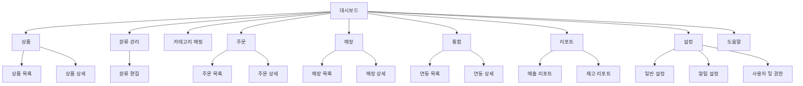

# Wireframe Menu Tree

이 파일은 와이어프레임을 그릴 때 바로 사용할 수 있도록 메뉴의 계층 구조, 라우트 경로, 메뉴 ID를 정리한 자료입니다. 아래에는

- 1) 사람이 읽기 쉬운 계층 목록
- 2) 기계/툴이 바로 사용할 수 있는 JSON 구조
- 3) Mermaid 다이어그램(복사해서 렌더하면 메뉴 맵 시각화 가능)

사용법: 와이어프레임 툴에서 메뉴 항목을 기준으로 화면(페이지)을 배치하세요. 각 항목에 명시된 `route`와 `menuId`를 참고하면 개발자와의 협업이 수월해집니다.

---

## 1) 계층 목록 (사람용)

- 대시보드 (`menuId`: `dashboard`, `route`: `/`)
  - 개요 / 요약 카드

- 상품 (`menuId`: `products`, `route`: `/products`)
  - 상품 목록 (`menuId`: `products-list`, `route`: `/products`)
  - 상품 상세 (`menuId`: `product-detail`, `route`: `/products/:id`)

- 분류 관리 (`menuId`: `classifications`, `route`: `/settings/classifications`)
  - 분류 편집 (트리) (`menuId`: `product-classifications`, `route`: `/settings/classifications`)

- 카테고리 매핑 (`menuId`: `category-mapping`, `route`: `/malls/category-mapping`)
  - 매핑 목록 / 생성 (`menuId`: `category-mapping-list`, `route`: `/malls/category-mapping`)

- 주문 (`menuId`: `orders`, `route`: `/orders`)
  - 주문 목록 (`menuId`: `orders-list`, `route`: `/orders`)
  - 주문 상세 (`menuId`: `order-detail`, `route`: `/orders/:id`)

- 매장(채널) (`menuId`: `malls`, `route`: `/malls`)
  - 매장 목록 (`menuId`: `malls-list`, `route`: `/malls`)
  - 매장 상세 (`menuId`: `mall-detail`, `route`: `/malls/:id`)

- 통합(Integrations) (`menuId`: `integrations`, `route`: `/integrations`)
  - 연동 목록 (`menuId`: `integrations-list`, `route`: `/integrations`)
  - 연동 상세 (`menuId`: `integration-detail`, `route`: `/integrations/:id`)

- 리포트(Reports) (`menuId`: `reports`, `route`: `/reports`)
  - 매출 리포트 (`menuId`: `reports-sales`, `route`: `/reports/sales`)
  - 재고 리포트 (`menuId`: `reports-inventory`, `route`: `/reports/inventory`)

- 설정(Settings) (`menuId`: `settings`, `route`: `/settings`)
  - 일반 설정 (`menuId`: `settings-general`, `route`: `/settings/general`)
  - 알림 설정 (`menuId`: `settings-notifications`, `route`: `/settings/notifications`)
  - 사용자 및 권한 (`menuId`: `settings-users`, `route`: `/settings/users`)

- 도움말/Support (`menuId`: `help`, `route`: `/help`)

---

## 2) JSON 구조 (툴 임포트용)

```json
{
  "menu": [
    { "id": "dashboard", "title": "대시보드", "route": "/" },
    {
      "id": "products",
      "title": "상품",
      "route": "/products",
      "children": [
        { "id": "products-list", "title": "상품 목록", "route": "/products" },
        { "id": "product-detail", "title": "상품 상세", "route": "/products/:id" }
      ]
    },
    {
      "id": "classifications",
      "title": "분류 관리",
      "route": "/settings/classifications",
      "children": [
        { "id": "product-classifications", "title": "분류 편집", "route": "/settings/classifications" }
      ]
    },
    { "id": "category-mapping", "title": "카테고리 매핑", "route": "/malls/category-mapping" },
    {
      "id": "orders",
      "title": "주문",
      "route": "/orders",
      "children": [
        { "id": "orders-list", "title": "주문 목록", "route": "/orders" },
        { "id": "order-detail", "title": "주문 상세", "route": "/orders/:id" }
      ]
    },
    {
      "id": "malls",
      "title": "매장",
      "route": "/malls",
      "children": [
        { "id": "malls-list", "title": "매장 목록", "route": "/malls" },
        { "id": "mall-detail", "title": "매장 상세", "route": "/malls/:id" }
      ]
    },
    {
      "id": "integrations",
      "title": "통합",
      "route": "/integrations",
      "children": [
        { "id": "integrations-list", "title": "연동 목록", "route": "/integrations" },
        { "id": "integration-detail", "title": "연동 상세", "route": "/integrations/:id" }
      ]
    },
    {
      "id": "reports",
      "title": "리포트",
      "route": "/reports",
      "children": [
        { "id": "reports-sales", "title": "매출 리포트", "route": "/reports/sales" },
        { "id": "reports-inventory", "title": "재고 리포트", "route": "/reports/inventory" }
      ]
    },
    {
      "id": "settings",
      "title": "설정",
      "route": "/settings",
      "children": [
        { "id": "settings-general", "title": "일반 설정", "route": "/settings/general" },
        { "id": "settings-notifications", "title": "알림 설정", "route": "/settings/notifications" },
        { "id": "settings-users", "title": "사용자 및 권한", "route": "/settings/users" }
      ]
    },
    { "id": "help", "title": "도움말", "route": "/help" }
  ]
}
```

---

## 3) Mermaid 다이어그램

아래 코드를 Mermaid 렌더러(예: VSCode 확장, mermaid.live, 또는 Mermaid CLI)로 렌더하면 메뉴 트리 시각화가 생성됩니다.



---

## 사용 팁
- 와이어프레임 도구에 JSON을 임포트할 수 있다면 위 JSON 구조를 사용하면 메뉴 노드/레벨을 자동으로 생성할 수 있습니다.
- Mermaid는 간단히 시각화를 확인하는 데 유용합니다. SVG로 내보내어 문서에 붙여넣으면 디자이너와 공유하기 편합니다.

원하시면 이 메뉴 트리를 기반으로 각 메뉴에 매핑된 와이어프레임 템플릿(예: 제품 목록 템플릿, 분류 편집 템플릿)도 생성해 드리겠습니다.
